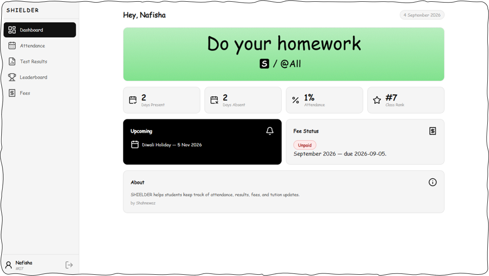

# SHIELDER
A web-based student data management dashboard designed to track academic results, attendance, monthly fee statuses, upcoming events, and announcements.

[](https://heysanzu.github.io/sanzuShielder/)
[](https://github.com/heysanzu/sanzuShielder/releases/download/SHIELDER_v1.0/shielder.apk)



---  

```bash
git clone https://github.com/heysanzu/sanzuShielder.git
cd sanzuShielder
```
<p align="left">
  
</p>

Maintained by [@heysanzu](https://github.com/heysanzu)
